# Welcome to github repository of Fran Ruiz - k4m1K4z3!

### Hola Mundo! Hello everyone! 👋

# RETO - PRIMEROS PASOS CON GIT

## **1.-Crea un repositorio nuevo que se llame retogit.**

 Accedemos a www.github.com, hacemos login con nuestra cuenta de usuario y una vez estamos en la página principal, hacemos clic en “NEW”. Después, tendremos que rellenar “repository name” y demás campos que reflejan las características que va a tener nuestro nuevo repositorio. Va a ser privado, y añadimos el “Readme”.

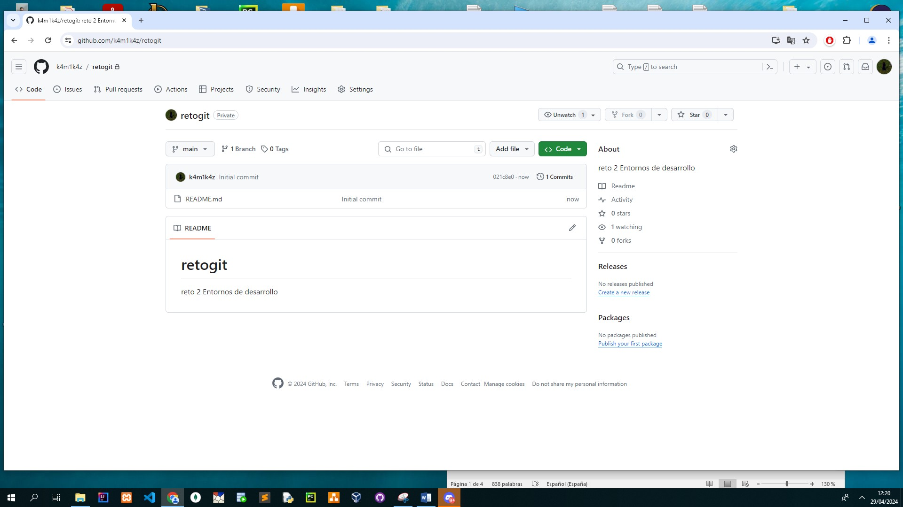

## **2.-Realiza la subida de la carpeta src de un proyecto en java.**

Para ello accedemos a nuestro repositorio y hacemos clic en ADD FILE y luego a “upload files”.Arrastramos la carpeta y añadimos una descripción corta en “Commit changes” , dejamos cliqueada la opción “  Commit directly to the main branch. “ y le damos a “Commit”

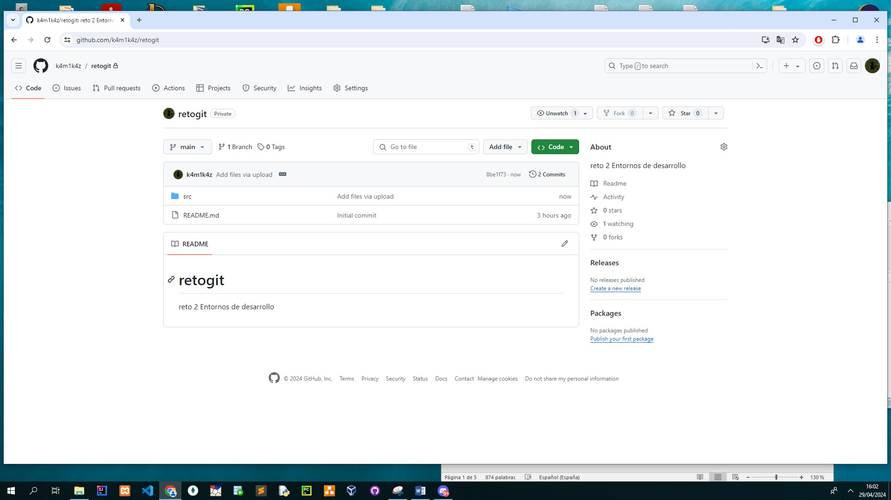

## **3.-Crea una nueva rama que se llame desarrolloPersona.**

Hacemos clic en “Branch” y damos a “Create New Branch”. Ponemos el nombre y dejamos como “source” la rama principal que es “main”. Despues, damos a Create New Branch

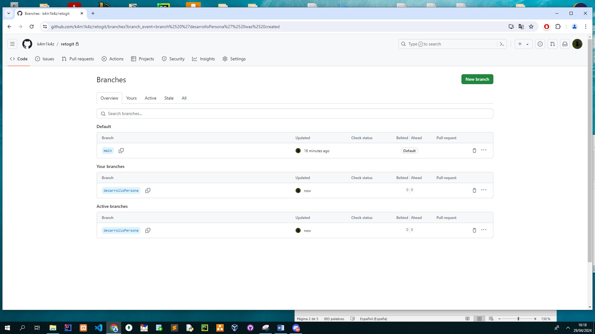

## **4.-Descarga el contenido de la rama a tu repositorio local.**

Para descargarlo, puedes clonarlo con “clone” y obtendrás los mismos archivos en tu carpeta de GitHub del PC o en el directorio indicado por defecto. Luego puedes ver si el contenido es idéntico viendo el Preview Pull Request, y de haber actualizaciones, se podría hacer un pull para traernos las nuevas actualizaciones.

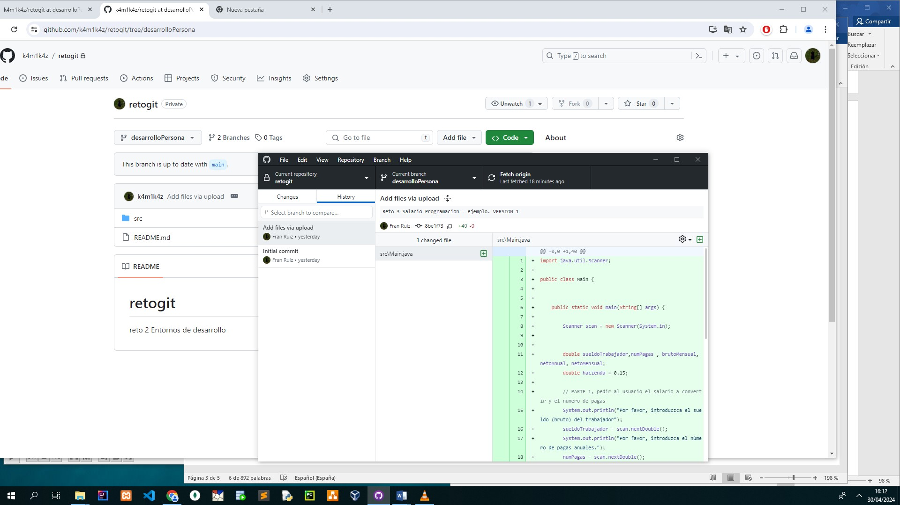

## **5.-Crea una clase nueva y realiza la actualización de la rama en el repositorio, documenta este proceso con el comentario “Nueva clase – nombre de la clase”.**

Creo una nueva clase “puesto” dentro del proyecto retogit y dentro creo el atributo “nombre”.Después, cliqueo en “commit” que es como mi declaración de intenciones de que yo quiero actualizar algo.

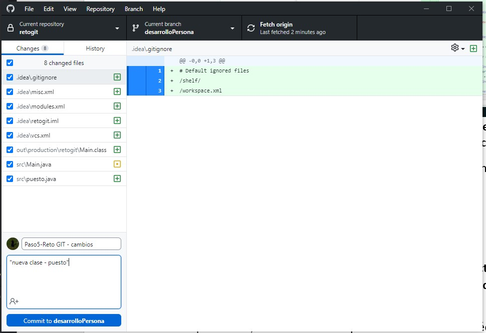

Por ultimo, para “lanzar” los cambios a nuestro repositorio de GitHub, tenemos que darle a Push: ( push commits to the origin remote )

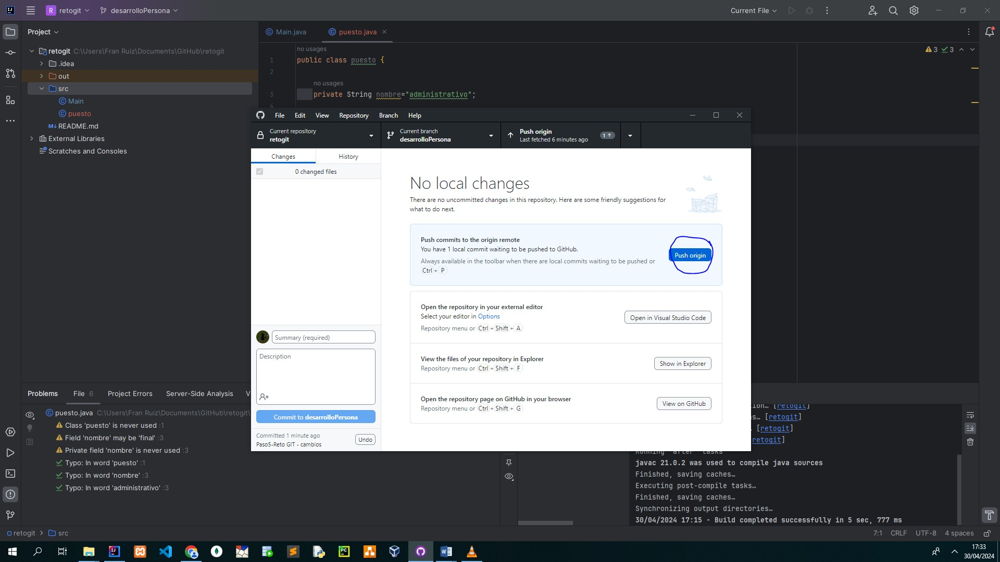

Y ahora, al acceder a nuestro nuevo repositorio, encontramos ya la nueva clase creada y en el titulo el nombre que hemos puesto antes de lanzar el commit:

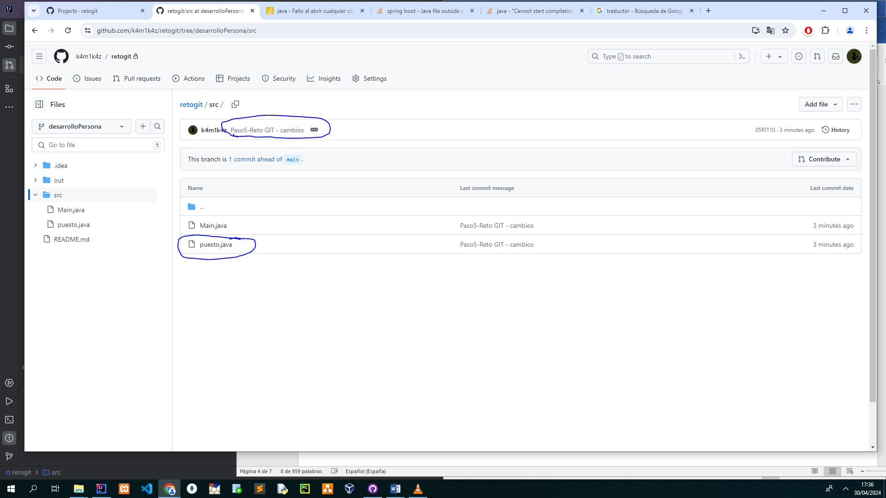

## **6.-Modifica algún atributo de la clase nueva y realiza la actualización de la rama en el repositorio, documenta este proceso con el comentario “Edición clase – nombre de la clase”.**

Accedemos al Intellij y modificamos el atributo. Cambio el valor del atributo de  “Administrativo” a “Enfermero” y  hacemos el Commit y después el Push origin

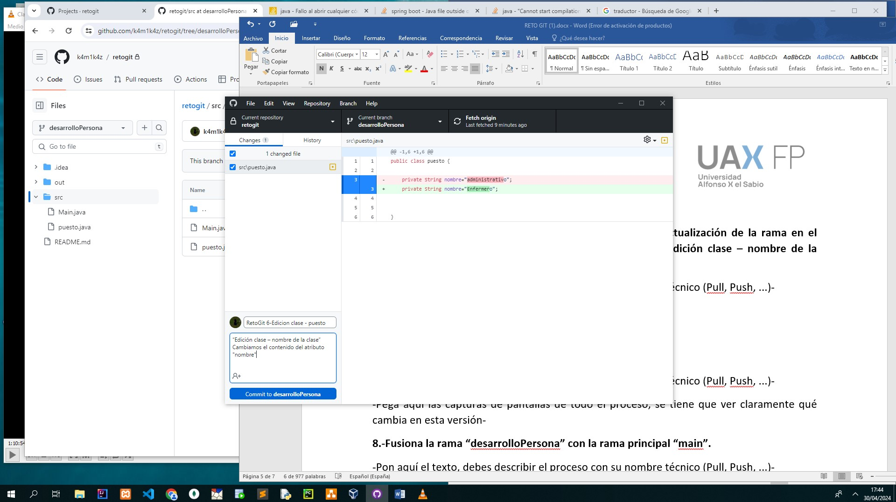

 Al acceder al repositorio en GitHub ya vemos que hay un push reciente realizado y para confirmar que está guardado el cambio accedemos a la clase nueva y vemos que el valor del atributo se ha cambiado, verificando que está Enfermero:

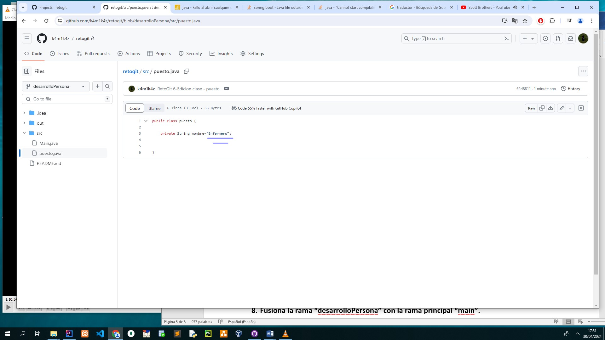

## **7.-Realiza una comprobación de los cambios.**

Este punto lo he ido haciendo mientras hacia los ejercicios para comprobar los cambios. Sin embargo, también si hacemos clic en pull request, aquí vemos los cambios realizados, los commits hechos e incluso el tiempo en el que se ha lanzado el commit con el cambio:

Y si lo queremos ver desde GitHub Desktop podemos verlo en el histórico:

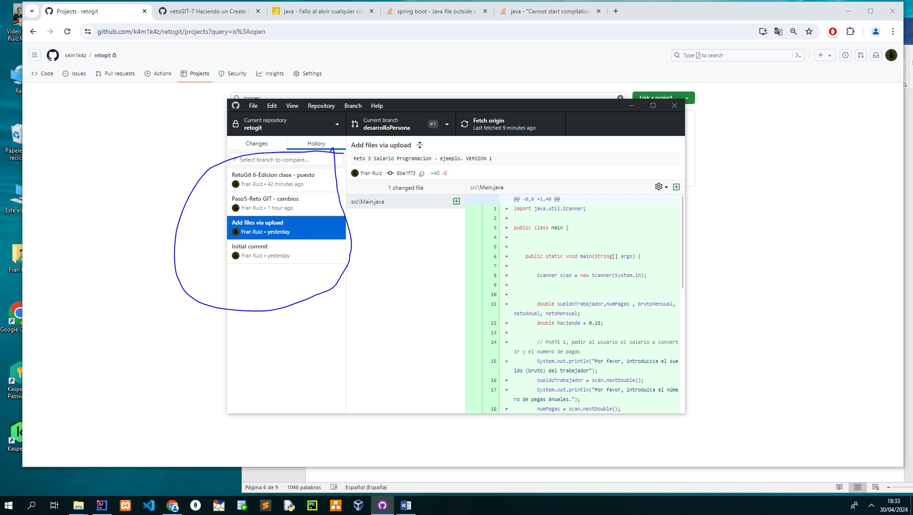

Y si lo queremos ver directamente en el archivo afectado, accedemos directamente a él en Github y en Code y Blame podemos ver los cambios que han tenido:

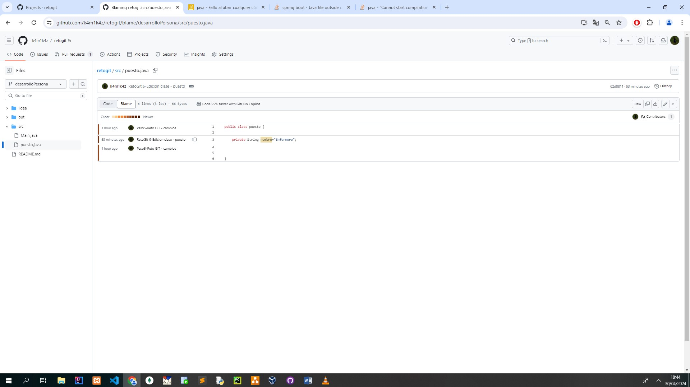

## **8.-Fusiona la rama “desarrolloPersona” con la rama principal “main”.**

Hacemos un “Create Push Request” y luego damos a “Merge pull request”

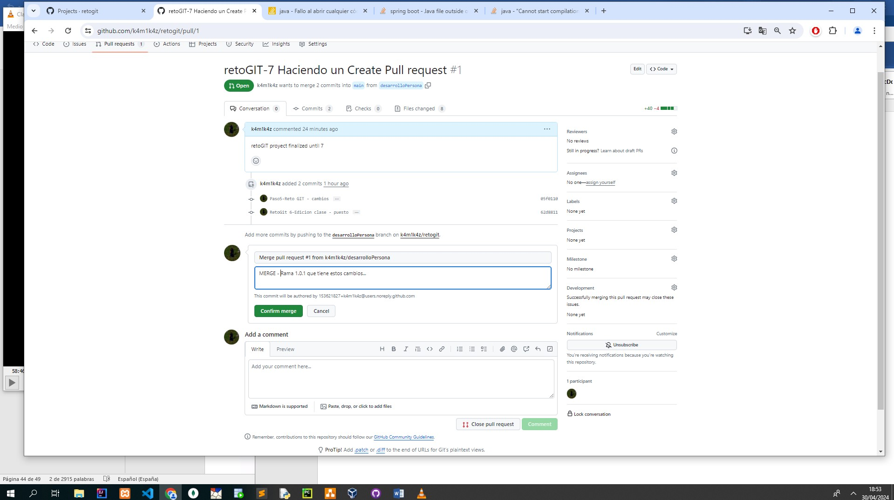

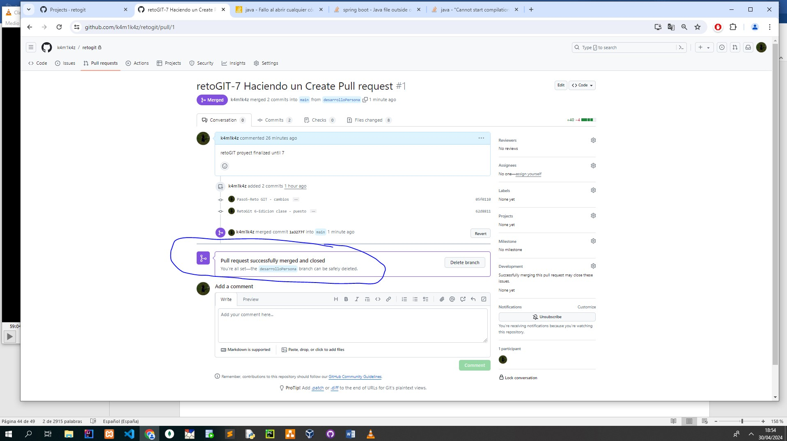

Y ya tendría en mi rama Main el proyecto principal con todas las modificaciones que he hecho

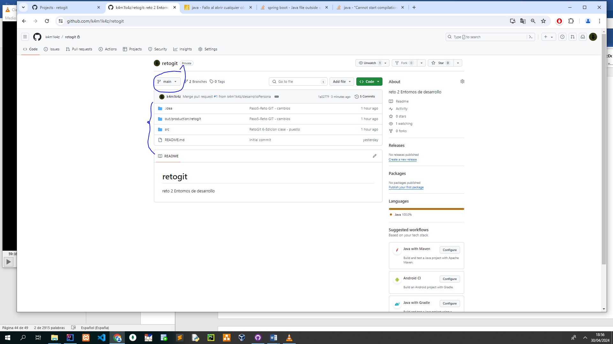

# **Ayuda con los terminos de operaciones básicas con GitHub**

Las funciones más importantes de GD son:

#### **1.	Clone (Clonar):**

Clona un repositorio remoto en tu máquina local. Este comando crea una copia exacta del repositorio, incluyendo todas las ramas y el historial de commits. Puedes clonar un repositorio desde la interfaz web de GitHub o usando la URL del repositorio en tu terminal.

#### **2.	Pull (Tirar):**

Descarga los cambios desde un repositorio remoto y los incorpora en tu rama local. Puedes hacer un pull desde la interfaz web de GitHub o utilizando el comando git pull en tu terminal.

### **3.	Push (Empujar):**

Sube tus cambios locales al repositorio remoto. Puedes hacer un push desde la interfaz web de GitHub o utilizando el comando git push en tu terminal.

### **4.	Commit:**

Guarda los cambios realizados en los archivos de tu repositorio. Cada commit tiene un mensaje asociado que describe los cambios realizados. Puedes realizar commits desde la interfaz web de GitHub o utilizando el comando git commit en tu terminal.

### **5.	Fetch (Recuperar):**

Descarga todos los cambios del repositorio remoto a tu repositorio local, pero no los incorpora automáticamente en tu rama actual. Se puede hacer un fetch desde la interfaz web de GitHub o utilizando el comando git fetch en tu terminal.

### **6.	Merge (Fusionar):**

Combina los cambios de una rama en otra rama. Por ejemplo, puedes fusionar una rama de desarrollo en una rama principal como main o master. Se puede hacer un merge desde la interfaz web de GitHub o utilizando el comando git merge en tu terminal.

### **7.	Branch (Rama):**

Permite trabajar en paralelo en diferentes líneas de desarrollo. Cada rama puede contener cambios independientes.Puedes crear, eliminar y administrar ramas desde la interfaz web de GitHub o utilizando el comando git branch en tu terminal.

### **8.	Pull Request (Solicitud de extracción):**

<p< Una solicitud de extracción es una forma de proponer cambios en un repositorio. Permite a otros revisar los cambios antes de fusionarlos en la rama principal. Se puede crear desde la interfaz web de GitHub.

<!--
**k4m1k4z/k4m1k4z** is a ✨ _special_ ✨ repository because its `README.md` (this file) appears on your GitHub profile.

Here are some ideas to get you started:

- 🔭 I’m currently working on ...
- 🌱 I’m currently learning ...
- 👯 I’m looking to collaborate on ...
- 🤔 I’m looking for help with ...
- 💬 Ask me about ...
- 📫 How to reach me: ...
- 😄 Pronouns: ...
- ⚡ Fun fact: ...
-->
